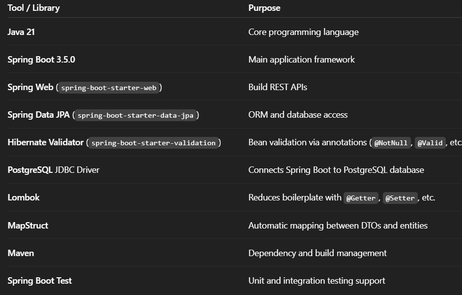

# Library Review Management System

This is a Spring Boot REST API that allows users to leave reviews on books. It uses a PostgreSQL database and follows clean architecture principles with DTOs, services, and repositories.

---

## Features

-  Create, Read, Update, Delete reviews
-  Uses DTOs to safely expose data
-  Validates input with `@Valid` and `@NotNull`
-  Returns safe `ReviewResponseDTO` (hides passwords, internal fields)
-  Maps entities using Spring + MapStruct
-  Connects `Review` to `User` and `Book` via `@ManyToOne`

---

## Review Structure

├── review/
│ ├── Review.java
│ ├── ReviewRequestDTO.java
│ ├── ReviewResponseDTO.java
│ ├── ReviewMapper.java
│ ├── ReviewService.java
│ └── ReviewController.java
│ ├── ReviewRepository.java

---

## 🛠️ Technologies Used



---

## 🔄 API Endpoints

Reviews
host = http://localhost:8080

| Method | Endpoint            | Description         |
|--------|---------------------|---------------------|
| GET    | `/api/reviews`      | Get all reviews     |
| GET    | `/api/reviews/{id}` | Get review by ID    |
| POST   | `/api/reviews`      | Create new review   |
| PUT    | `/api/reviews/{id}` | Update review       |
| DELETE | `/api/reviews/{id}` | Delete review       |

### Example JSON for POST/PUT with PostMan

```json
{
  "userId": 1,
  "bookId": 3,
  "comment": "Great book!",
  "rating": 5
}
```

### Configure application.properties for your PostgreSQL if needed
spring.datasource.url=jdbc:postgresql://localhost:5432/library
spring.datasource.username=your_username
spring.datasource.password=your_password

Run the app:
./mvnw spring-boot:run
